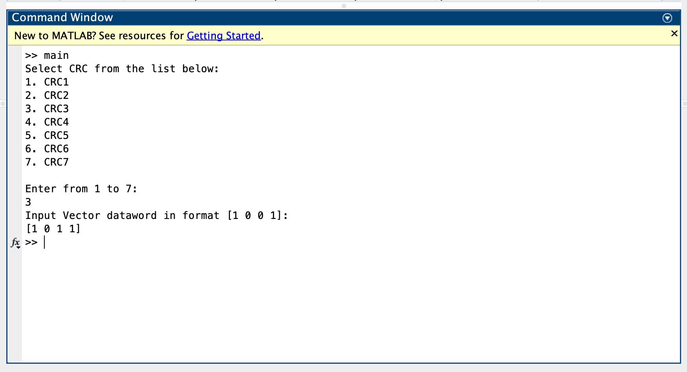
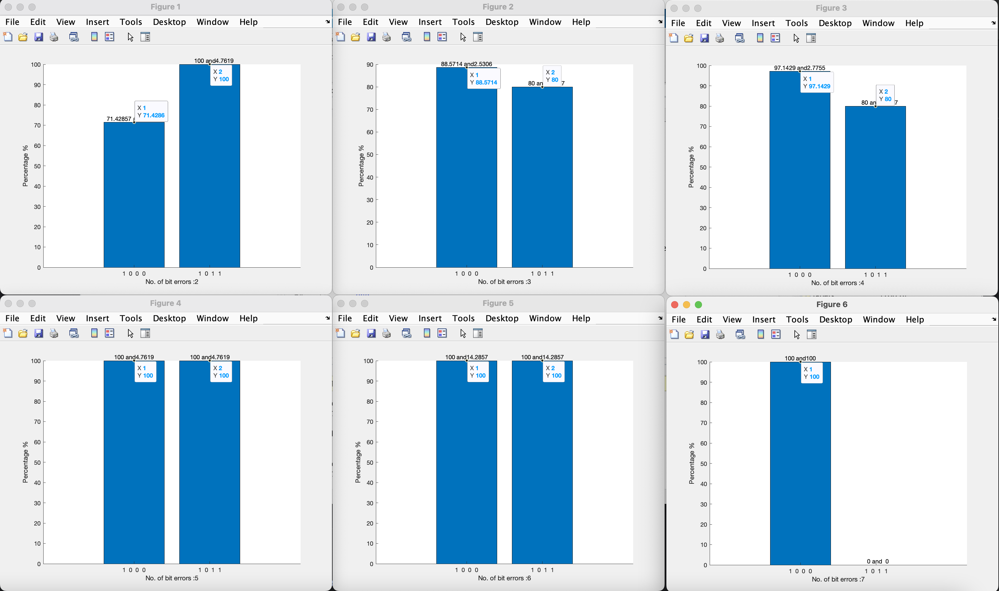

# Dependable System Design

Presented By
---
### `Ruchi Joshi UniversityID: 01437864`

Problem Statement
---

Detecting errors in Wireless Sensor Network's (WSN's) transmitted data using CRC

What it does
---

Given a dataword and value for CRCN in the main.m, percentage probability of error detection and correction is displayed in the form of series of bar graphs.

Files
---

```
main.m

percentageDetection.m

generateCodeword.m

detectErrors.m
```

Requirements
===
### Software
* MATLAB R2022a Simulink Version (Latest Version)

### Hardware
* MacOS or similar
* RAM: 2GB or more
* Memory: 500MB or more

How to Run
===
Run main.m in MATLAB, input N to select the CRC. E.g. if you want to use CRC1 then input 1 or 7 for CRC7. 

Input the dataword vector. E.g. [1 0 0 1] (Note: Make sure to add spaces between 1s and 0s followed by the square brackets at start and end just like the example)

The following image will provide an idea:



OUTPUT
===

The output of the program will be a series of bar graphs. The X coordinate contains the generators and the y coordinate contains percentage probability of error detection. The data on top of each bar represents percentage error detection and percentage error correction.


